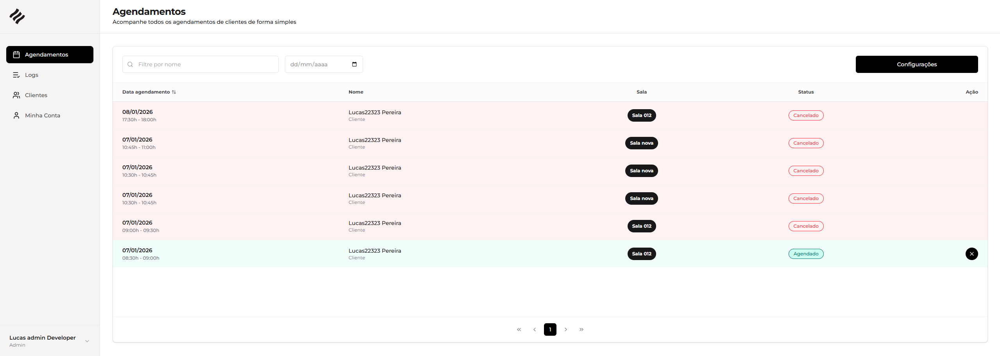

## 💻 Scheduling App

O Scheduling App é uma aplicação web para gerenciamento de agendamentos, com áreas distintas para usuários e administradores. O sistema permite o cadastro, visualização e administração de horários, salas e usuários, proporcionando uma experiência intuitiva e responsiva.

### Funcionalidades Principais

- **Autenticação de Usuário:** Tela de login segura para acesso ao sistema.
- **Área do Usuário:** Visualização e criação de agendamentos, escolha de sala, data e horário disponíveis.
- **Área do Administrador:** Gerenciamento de usuários, salas, horários e visualização de logs do sistema.
- **Configuração de Salas:** Cadastro e edição de salas, horários de funcionamento e intervalos de agendamento.
- **Interface Responsiva:** Layout adaptado para diferentes dispositivos, com experiência otimizada para desktop e mobile.
- **Feedback Visual:** Notificações e mensagens de sucesso/erro para ações do usuário.

<br/>

## 🚀 Link do deploy do projeto (clique para entrar)

<h2>OBS: email: admin@email.com / senha: admin123</h2>

<a href="https://support-app-neon.vercel.app" target="_blank" rel="external">

</a>

<h2>Link: <a href="https://support-app-neon.vercel.app" target="_blank" rel="external">Projeto</a></h2>

<br/>
<br/>

## 💻 Pré-requisitos

Antes de começar, verifique se você atendeu aos seguintes requisitos:
- Você possui uma máquina `<Windows / Linux / Mac>`
- Node.js instalado (versão recomendada: a mais recente LTS)

<br/>

## ⚙️ Instalação

No terminal, execute um dos comandos abaixo para instalar as dependências:

npm:
```
npm i
```
yarn:
```
yarn install
```
pnpm:
```
pnpm i
```

<br/>

## 🚀 Rodando o Projeto

1. Crie um arquivo `.env.local` na raiz do projeto e adicione a seguinte variável de ambiente, apontando para a URL do seu backend (exemplo: `http://localhost:3333`):

```
NEXT_PUBLIC_API_BASE_URL="http://localhost:3333/api"
```

2. Para iniciar o projeto, utilize:

npm:
```
npm run dev
```
yarn:
```
yarn dev
```
pnpm:
```
pnpm run dev
```

<br/>

## 🖥️ Estrutura do Projeto

- **/src/app**: Páginas da aplicação (login, dashboard, áreas de admin e usuário)
- **/src/components**: Componentes reutilizáveis (tabelas, modais, sidebar, etc)
- **/src/hooks**: Hooks customizados para requisições e mutações
- **/src/types**: Tipagens TypeScript para entidades do sistema
- **/src/utils**: Funções utilitárias (formatação, mensagens, etc)
- **/public**: Arquivos estáticos e imagens

<br/>

## 🛠️ Tecnologias Utilizadas

O projeto foi desenvolvido com as seguintes tecnologias e bibliotecas:

- **TypeScript** 
- **ReactJS** 
- **Next.js** 
- **TailwindCSS** 
- **Radix UI** (componentes acessíveis)
- **React Hook Form** + **Zod** (validação de formulários)
- **TanStack Query** (gerenciamento de dados assíncronos)
- **Next Auth** (autenticação)
- **React Toastify** (notificações)
- **Lucide React** (ícones)

<br/>

## 📄 Observações

- O projeto segue boas práticas de Clean Code e arquitetura modular.
- O layout é totalmente responsivo e focado em usabilidade.
- Para dúvidas ou sugestões, fique à vontade para abrir uma issue.

---

